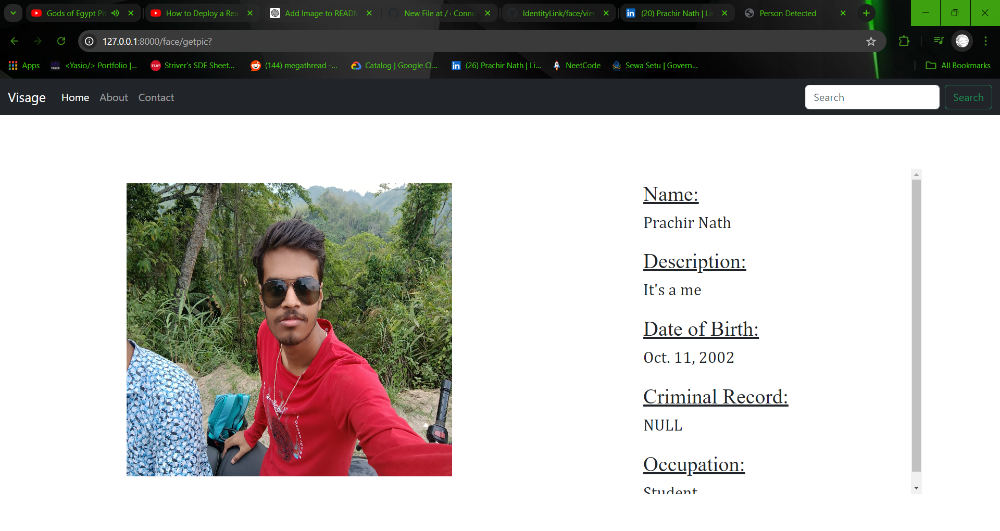

This web application is developed using Django and leverages advanced Python libraries such as OpenCV, face_recognition, and NumPy to perform facial recognition. The system is designed to scan and analyze a person's face and then cross-reference the facial data with entries stored in an SQLite3 database. If a match is found, the application retrieves and displays the associated information.

Key Features:

1. Django Framework: The application is built on Django, providing a robust and scalable backend.
2. Facial Recognition: Utilizes the face_recognition library, powered by deep learning models, to accurately identify and verify individuals based on facial features.
3. Image Processing: Integrates OpenCV for efficient image processing tasks, such as capturing and preprocessing the facial images.
4. Data Management: Employs SQLite3 for storing and managing user data, making it easy to access and update records.
5. NumPy Integration: Uses NumPy for efficient numerical operations, particularly in handling and processing image data.

# Home Page

This is the home page of the website, where users are prompted to activate their camera to capture a live image of their face. Upon pressing the "SNAP" button, the application processes the captured image and attempts to match the face with records stored in the database. If a match is found, the corresponding user information is retrieved and displayed.

# Result Page

If the person's face is matched in the database, their biodata will be displayed in the result page.
